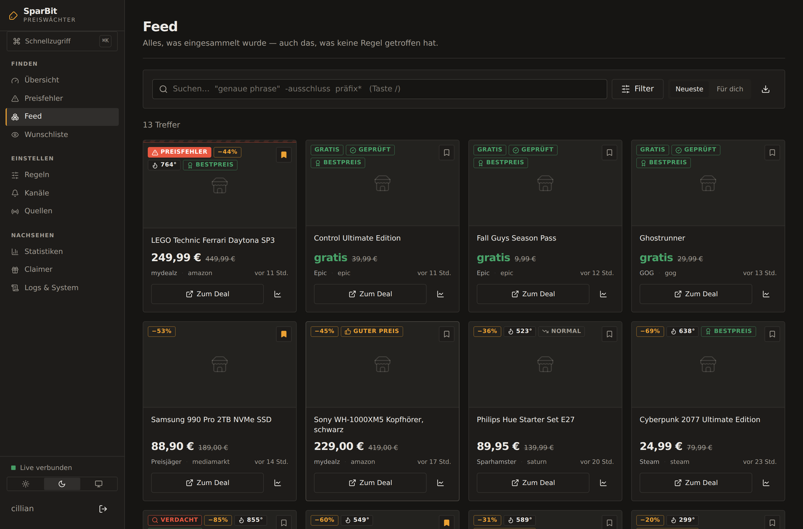
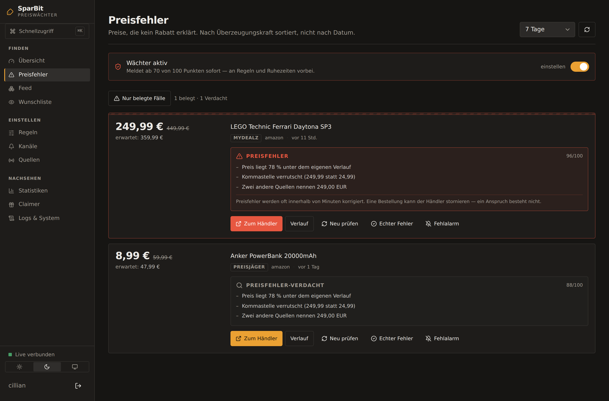
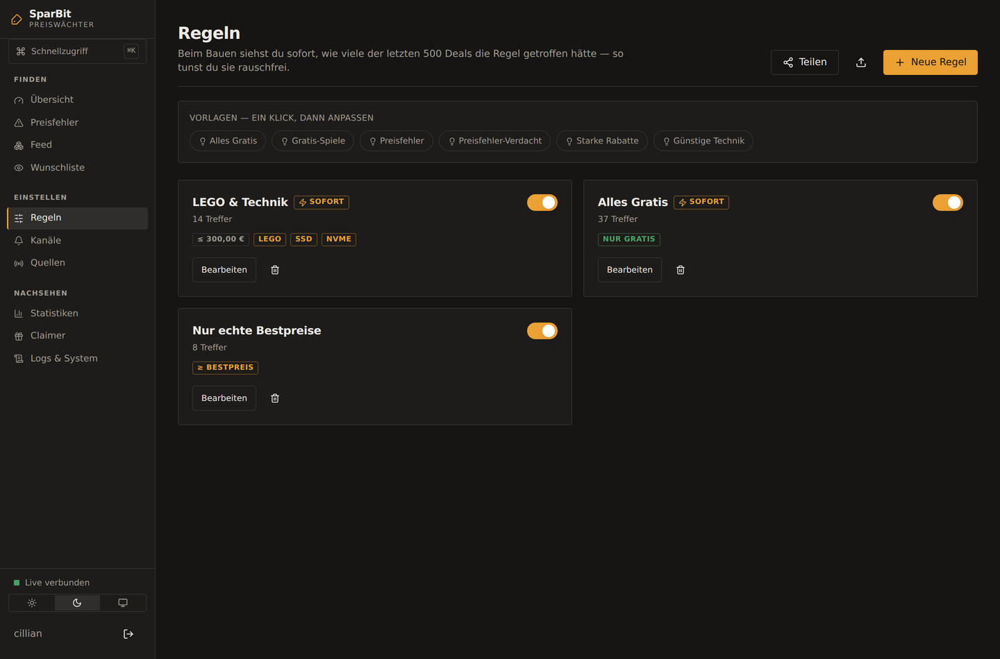
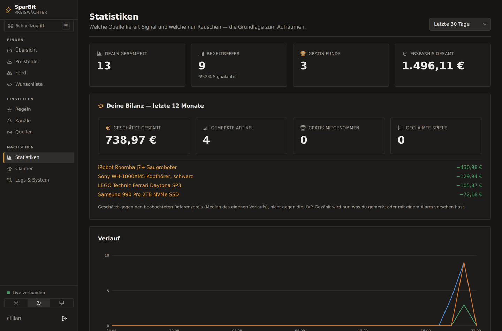

# SparBit

**Findet Preisfehler, bevor sie korrigiert sind.**

Ein Preisfehler ist kein Rabatt. Es ist ein Versehen des Händlers — eine
verrutschte Kommastelle, eine vergessene Null. Der Fernseher für 899 € steht
plötzlich für 89,90 € drin, und zwanzig Minuten später nicht mehr.

SparBit beobachtet dafür rund um die Uhr 17 Deal-Quellen, vergleicht jeden
Preis mit dem **eigenen beobachteten Verlauf** und mit dem, was andere Quellen
für denselben Artikel verlangen — und weckt dich, wenn etwas nicht
zusammenpasst. Mit Begründung, nicht mit einer Punktzahl.

Nebenbei macht es das, was ein Deal-Monitor sonst so macht: Gratis-Spiele
einsammeln, Wunschlisten überwachen, nach deinen Regeln filtern und über elf
Kanäle melden — bis hin zu Push direkt in den Browser.

   

**Auf einem VPS** — ein Befehl, inklusive Docker, HTTPS, Zertifikat und
Update-Knopf im UI:

```bash
curl -fsSL https://raw.githubusercontent.com/StrikerLUL/spar_bit/refs/heads/main/install.sh | bash
```

**Auf dem eigenen Rechner** — kein Docker, keine Konfigurationsdatei:

```bash
git clone https://github.com/StrikerLUL/spar_bit.git
cd spar_bit
python run.py
```

Python 3.11 genügt. Node.js ist optional: fehlt es, holt sich `run.py` die
fertig gebaute Oberfläche aus dem letzten Release (mit Prüfsumme).

---

## So sieht es aus

| | |
|---|---|
|  |  |
| **Feed** — jeder Deal mit Urteil aus dem eigenen Verlauf, Gratis-Funde mit Gegenprobe | **Preisfehler** — mit Begründung, nicht mit einer Punktzahl |
|  |  |
| **Regeln** — die Live-Vorschau sagt beim Bauen, wie viele der letzten 500 Deals getroffen worden wären | **Bilanz** — was das Ganze gebracht hat, gerechnet gegen den eigenen Verlauf statt gegen die UVP |

---

## Dokumentation

Dieses README ist der Einstieg. Alles Weitere steht daneben — sortiert nach
dem, was man gerade sucht:

| Seite | Worum es geht |
|---|---|
| **[Preisfehler](docs/preisfehler.md)** | Wie die Erkennung urteilt, was sie *nicht* meldet, und wie du sie eichst |
| **[Was SparBit kann](docs/funktionen.md)** | Quellen, Urteile, Regeln, Wunschliste, Gratis-Gegenprobe |
| **[Betrieb](docs/betrieb.md)** | VPS, eigener Rechner, Reverse-Proxy, Updates, Auto-Claimer |
| **[Benachrichtigungen](docs/benachrichtigungen.md)** | Telegram, Discord, Matrix, ntfy, Web Push, Apprise und der Rest |
| **[Kommandozeile & API](docs/kommandozeile.md)** | Alles, was die Oberfläche kann, geht auch ohne sie |
| **[Entwicklung](docs/entwicklung.md)** | Aufbau, eigene Quellen, eigene Kanäle, Tests |
| **[Sicherheit & Problemlösung](docs/sicherheit.md)** | Was geschützt ist, was nicht, und was zu tun ist, wenn es klemmt |
| **[ENDPOINTS.md](ENDPOINTS.md)** | Welche Quelle welchen Endpunkt nutzt — und welche ungeprüft ist |
| **[CHANGELOG.md](CHANGELOG.md)** | Was der nächste Klick auf *Aktualisieren* bringt |
| **[CONTRIBUTING.md](CONTRIBUTING.md)** | Wie hier gearbeitet wird |

> **Vor dem ersten Start: [ENDPOINTS.md](ENDPOINTS.md) lesen.**
> Kein Quellen-Endpoint konnte beim Bauen live geprüft werden — die
> Build-Umgebung hatte keinen Netzzugang zu den Deal-Seiten. Alle Quellen
> starten als *ungeprüft*; ein Befehl bzw. ein Knopf im UI verifiziert sie auf
> deinem Rechner. Das ist Absicht: lieber ehrlich ungeprüft als falsch
> „funktioniert".

---

## In Kürze

**Finden** — 17 Quellen als Plugins (Deal-Communities aus vier Ländern,
Reddit, Gaming-Stores, eigene RSS-Feeds, eigene JSON-Schnittstellen), dazu eine
Wunschliste, die Artikel selbst beobachtet, statt auf Posts zu warten.
Steam-Wunschlisten lassen sich übernehmen, Feedreader-Listen per OPML einlesen.

**Zusammenführen** — derselbe Artikel aus vier Quellen kommt einmal an. Wo eine
Produktkennung in der Adresse steht (ASIN, Steam-AppID, GTIN), wird nicht mehr
geraten, sondern gewusst.

**Beurteilen** — der Rabatt der Quelle sagt wenig, weil er gegen eine UVP
rechnet, die nie jemand bezahlt hat. SparBit urteilt aus dem eigenen
Preisverlauf: *Bestpreis*, *sehr gut*, *war günstiger*, *UVP fragwürdig* — und
sagt „zu wenig Daten", statt zu raten. Steht ein Gutschein-Code im Text, steht
er auf der Karte statt im gekürzten Fließtext.

**Filtern** — Regeln aus Keywords, Preisgrenzen, Mindestrabatt, Preisurteil,
Warengruppe und Preisfehler-Punktzahl, mit Live-Vorschau und Begründung je
Deal. Und die Gegenrichtung: zu jedem Fund sagt SparBit, **warum er nicht
angekommen ist** — Stufe für Stufe, von der ersten Regel bis zum Versandprotokoll.
Der Feed lernt mit, lokal und erklärbar. Regeln lassen sich exportieren und
weitergeben.

**Melden** — zwölf Kanäle: Telegram, Discord, Slack, Matrix, ntfy, Gotify,
Pushover, E-Mail (auch als HTML), Webhook, **Web Push direkt in den Browser**,
**Home Assistant über MQTT** (der Sensor erscheint drüben von selbst) und
**Apprise** für alles Weitere (Signal, Mastodon, Teams …). Dazu Ruhezeiten,
Sammelmeldungen und eine Erinnerung, bevor ein Angebot ausläuft.

**Nicht verpassen** — Angebote mit Frist landen auf Wunsch als
abonnierbarer Kalender im Handy, mit Erinnerung sechs Stunden vorher.

**Im Haushalt** — mehrere Konten mit eigenen Regeln, Kanälen und
Wunschlisten. Quellen und gesammelte Deals bleiben gemeinsam.

**Für dich behalten** — alles läuft auf deinem Rechner. Kein Konto, keine
Telemetrie, keine Cloud. Deal-Bilder werden lokal zwischengespeichert, damit
der Händler beim Blättern nicht deine IP sieht. Der einzige Abruf, den SparBit
von sich aus macht, sind die Wechselkurse der EZB — eine Datei am Tag, und
abschaltbar.

**Auf Deutsch, auf Englisch** — die Oberfläche spricht beides, und Zahlen,
Daten und Dauern folgen der Sprache. Umschalten unten links.

---

## Der ganze Funktionsumfang

Oben steht, worum es geht. Hier steht alles. Jede Zeile hat ihre
ausführliche Fassung in der [Dokumentation](#dokumentation) — das hier ist
die Liste, damit nichts unentdeckt bleibt, was schon eingebaut ist.

### Quellen

| | |
|---|---|
| **Deal-Communities** | mydealz, Preisjäger.at, HotUKDeals, Dealabs |
| **Blogs** | Sparhamster.at, Schnäppchenfuchs |
| **Reddit** | GameDeals, FreeGameFindings, freebies, googleplaydeals, AppHookup, Schnaeppchen — Subreddits im UI pflegbar |
| **Gaming** | Epic Games Store, GOG, Steam, CheapShark, IsThereAnyDeal, GG.deals |
| **International** | Slickdeals (US, USD), OzBargain (AU, AUD) — wegen der Zeitzone oft die erste Quelle, die einen weltweiten Preisfehler meldet |
| **Eigene** | beliebige RSS/Atom-Feeds und eigene JSON-Schnittstellen (Adresse und Feldnamen genügen, kein Code) |

* Jede Quelle **einzeln schaltbar**, mit eigenem Intervall und eigenen
  Optionsfeldern. Ein Mindestintervall lässt sich im UI nicht unterschreiten.
* **Schutzschalter je Quelle:** nach fünf Fehlern in Folge pausiert sie
  automatisch; im UI steht, warum. Fällt eine Quelle aus, laufen die anderen
  weiter.
* **Drosselung wird verstanden:** ein `429` ist kein Defekt. Die Quelle macht
  Pause, setzt beim nächsten Lauf *dort fort, wo sie stand*, und steht im UI
  als *gedrosselt bis …* statt als *Fehler*.
* **Feed-Suche statt Raten:** kommt HTML statt eines Feeds, liest SparBit die
  ausgezeichnete Feed-Adresse aus der Seite, probiert sonst die bekannten
  Muster der Shop-Software (Pepper, Shopify, WordPress) durch — und
  **schreibt die funktionierende Adresse in die Einstellungen zurück**.
* **Jetzt testen** ruft den echten Endpunkt auf und zeigt die ersten Treffer
  mit Klartext-Befund; `python -m tools.verify_endpoints` prüft alle auf
  einmal.
* **API-Keys** nur für IsThereAnyDeal und GG.deals, beide kostenlos. Alles
  andere läuft ohne.
* **OPML-Import und -Export** — die Feed-Liste aus deinem Feedreader kommt in
  einem Rutsch herein und genauso wieder heraus.

### Wunschliste

* Artikel, die SparBit **selbst beobachtet** — unabhängig davon, ob sie jemand
  als Deal postet. Shop-URL und Zielpreis eintragen, den Rest macht SparBit.
* Der Preis kommt aus **strukturierten Daten** (JSON-LD, Open Graph,
  Microdata), nicht aus geratenen CSS-Selektoren. Liefert eine Seite davon
  nichts, sagt SparBit das, statt sich etwas auszudenken.
* **Versandkosten zählen mit**, wo der Shop sie auszeichnet: 195 € plus 9,90 €
  sind teurer als 199 € versandkostenfrei. *Keine Angabe* und *kostenlos*
  bleiben dabei zwei verschiedene Dinge — der Gesamtpreis trägt dieselbe
  Unsicherheit wie vorher, nicht mehr.
* **Mehrere Listen mit Budget je Liste** — die Leiste zeigt den Rest (negativ,
  wenn überzogen) und wie viele Artikel ihren Zielpreis erreicht haben.
* **Sammeleingabe:** mehrere Adressen einfügen, eine je Zeile; Namen und
  Preise holt SparBit selbst.
* **Steam-Wunschliste übernehmen** — Profilname, Steam-ID oder Adresse, ohne
  API-Schlüssel.
* **Shops, die ihren Preis erst per JavaScript setzen**, bleiben ehrlich
  *„kann ich nicht lesen"*. Wer sie trotzdem braucht, stellt einen
  Render-Dienst daneben (browserless, eigener Playwright-Container) und
  schaltet ihn je Artikel frei. Kein Browser im Image: das wäre ein halbes
  Gigabyte und ein eigener Angriffspfad für eine Handvoll Shops.
* **[Browser-Erweiterung](browser-extension/)** für Chrome, Edge, Brave und
  Firefox: Artikel in einem Klick von jeder Shop-Seite auf die Liste setzen,
  und direkt dort sehen, wenn SparBit ihn woanders günstiger kennt. Sie nutzt
  ein eigenes, einzeln zurückziehbares Token.

### Preise und Urteile

| Urteil | Bedeutung |
|---|---|
| **Bestpreis** | so günstig war es noch nie beobachtet |
| **sehr gut / gut** | im unteren Viertel des bisher Gesehenen |
| **normal** | üblicher Preis |
| **war günstiger** | nennt dir, wann es billiger war |
| **UVP fragwürdig** | kam nie in die Nähe seiner angeblichen UVP |
| **zu wenig Daten** | unter vier Messungen wird nicht geraten |

* **Preisverlauf** je Deal, mit Tiefst- und Höchstpreis in der Detailansicht.
* **Preisalarm** je Deal — löst genau einmal aus, nicht bei jedem Durchlauf.
* **Preisvergleich über Quellen:** was jede Quelle verlangt, wird einzeln
  gespeichert und als Tabelle gezeigt, günstigster zuerst, jede Zeile mit
  eigenem Link.
* **Währungsumrechnung** (USD, GBP, CHF, PLN, AUD → EUR), damit „max. 20 €"
  auch bei einer Dollar-Quelle greift. Der Gegenwert steht daneben:
  `29,99 $ · ≈ 27,59 €`. Die Kurse kommen **täglich von der EZB** — eine
  Datei, kein Schlüssel, abschaltbar; daneben steht ihr Datum. Ein fester
  Kurs im Code altert nämlich still: niemand bekommt eine Fehlermeldung,
  wenn „max. 20 €" seit einem Jahr bei 21,40 € zuschlägt.
* **Gutschein-Code aus dem Text**, auf der Karte und in der Meldung. Gesucht
  wird nie nach dem Code allein, sondern immer nach dem Wort, das ihn
  ankündigt — sonst stünde in jeder zweiten Meldung eine Artikelnummer, der
  man an der Kasse glaubt.
* **Titel-Preisparser mit Etiketten:** `statt`/`UVP` markiert den alten,
  `nur`/`jetzt`/`für` den neuen Preis — und eine Zahl ohne Währungszeichen
  wird nur akzeptiert, wenn sie ein Paar vervollständigt. Sonst meldet
  `3 für 2 Aktion: 14,99 €` einen Preis von 2 €.
* **Produktvarianten bleiben getrennt** — „Hades" und „Hades II", „990 Pro"
  und „990 Evo", „iPhone 15 128 GB" und „256 GB".

### Preisfehler-Wächter

* Keine Rabattschwelle, sondern **acht Indizien**, addiert zu 0–100:
  ausdrücklich als Preisfehler ausgewiesen (55) · „vermutlich Preisfehler"
  (30) · weit unter dem eigenen Verlauf (25–45) · noch nie annähernd so
  günstig (15) · andere Quellen verlangen ein Vielfaches (18–35) ·
  **verrutschte Kommastelle** (30) · Extremrabatt auf glaubwürdigem UVP (20) ·
  sehr hohe Resonanz (10, stützt nur, trägt nie allein).
* **Ab 70 Punkten** meldet er sofort, **ab 45** erscheint der Fund nur im
  Feed und auf der Preisfehler-Seite.
* **Eigener Meldeweg neben den Regeln:** keine Regel nötig, keine Ruhezeit,
  über alle aktiven Kanäle — mit 12-Stunden-Sperre je Deal, damit derselbe
  Fund nicht jede Nacht weckt. Zusätzlich werden alle 20 Minuten die Deals
  der letzten Woche neu bewertet.
* **Gedämpft wird, was nur billig aussieht:** Gratis-Angebote, Gutscheine,
  Sammeldeals, Verträge, Abos, B-Ware, Refurbished, Spiele-Shops und
  Kleinbeträge unter 25 € Ersparnis.
* **Die Meldung nennt die Indizien, nicht die Punktzahl** — nur so lässt sich
  in zwei Sekunden entscheiden, ob man dem Fund glaubt.
* **Eichung aus deinen Rückmeldungen:** „Echter Fehler" / „Fehlalarm" (auch
  per Telegram-Knopf) ergibt eine Auswertung, welches Indiz bei dir wie oft
  richtig lag — samt Vorschlag für die Schwelle. Übernommen wird sie erst auf
  Knopfdruck.

### Gratis-Gegenprobe

* **Worauf sich das Wort bezieht:** „inkl. gratis Versand" ist kein
  Gratis-Artikel. SparBit prüft den Kontext und schreibt den Grund als kleine
  Zeile unter den Preis.
* **Nachsehen:** für jeden als geschenkt gemeldeten Fund wird die Zielseite
  aufgerufen und mit dem verglichen, was der Händler dort maschinenlesbar
  auszeichnet — `geprüft`, `stimmt nicht`, `abgelaufen`, oder nichts.
* **Bei Unsicherheit behält die Quelle recht.** Ein Wächter, der aus einer
  Cloudflare-Abweisung einen Widerspruch ableitet, wäre schlimmer als keiner.
* Läuft **vor** den Regeln, ist pro Quellenlauf gedeckelt (Vorgabe 12
  Seitenaufrufe) und lässt sich abschalten oder enger stellen.

### Regeln und Feed

* Bedingungen: Keywords (ODER), Pflicht-Keywords (UND), Blacklist,
  Preisgrenze, Mindestrabatt, „nur 0 €", Mindest-Temperatur, Preisurteil,
  **Preisfehler-Punktzahl**, Quellen-, Warengruppen- und Händlerfilter.
* **Warengruppen** sagen, *was* ein Fund ist — Elektronik, Haushalt,
  Werkzeug, Spielzeug und acht weitere —, nicht aus welcher Art Quelle er
  kam. Erkannt aus Stichwörtern, also nachvollziehbar: daneben steht das
  Wort, das die Einteilung ausgelöst hat. Was sich nicht erkennen lässt,
  bleibt ohne Gruppe; „Sonstiges" wäre eine Antwort, die so aussieht, als
  hätte jemand hingesehen.
* Priorität **SOFORT** (Push in Sekunden) oder **NORMAL** (Sammelmeldung).
* **Live-Vorschau beim Bauen:** wie viele der letzten 500 Deals getroffen
  worden wären, mit Beispielen, den *knapp verfehlten* und je Deal einer
  Begründung, warum er getroffen oder gescheitert ist.
* **Und die Gegenrichtung: „Warum kam das nicht an?"** In der Detailansicht
  jedes Deals läuft derselbe Weg ab, den die Zustellung nimmt — jede
  einzelne Regel, Preisfehler-Weg, globale Pause, Ruhezeit, Kanäle,
  Versandverlauf. Jede Stufe sagt, ob sie durchlässt, und wenn nicht: warum
  und was dagegen zu tun wäre. Vorher hieß die Antwort darauf: an vier
  Stellen nachsehen und am Ende raten, ob die Regel nicht traf oder der
  Kanal nicht zustellte.
* **Der Feed lernt mit** — lokal, ohne externen Dienst. Sortierung *Für dich*,
  und jede Empfehlung sagt, warum sie dasteht. Aus demselben Verhalten
  schlägt SparBit fertige Regeln vor („16 von 16 gemerkten Deals passen zu
  ‚lego'"), und hält den Mund, solange zu wenig Signal da ist.
* **Regel-Durchsicht:** welche Regel viel Lärm und wenig Beachtung erzeugt,
  welche seit Wochen leerläuft (oft ein Tippfehler im Stichwort), welche
  Quelle nur Füllmaterial liefert. Mit Vorschlag, ohne Automatik.
* **Regeln teilen** als JSON — ohne Kanal-Zuordnung und Trefferzahlen.
  Eingespielte Regeln kommen **ausgeschaltet** an.
* **Suche über SQLite-FTS5**, schnell auch bei 50.000 Deals:
  `lego technic` (beide Wörter), `"nintendo switch"` (Wortfolge),
  `ssd -gebraucht` (ausschließen), `kopfhör*` (Präfix). Suchen lassen sich
  speichern.

### Benachrichtigungen

| Kanal | Wofür |
|---|---|
| **Telegram** | unterwegs, mit Aktions-Knöpfen — und Befehlen im Chat |
| **Discord** | Einbettung mit Farbe und Bild, Rollen-Erwähnung nur bei SOFORT |
| **Slack** | Block-Kit-Nachricht in den Team-Kanal |
| **Matrix** | eigener Homeserver, keine fremde Cloud |
| **Gotify** | selbst gehosteter Push |
| **Pushover** | Push auf iOS/Android ohne eigenen Server |
| **ntfy** | Push ohne Konto, ntfy.sh oder eigene Instanz |
| **E-Mail** | SMTP, auf Wunsch als HTML-Tabelle mit Bildern |
| **Webhook** | Home Assistant, n8n, eigene Skripte — bekommt JSON |
| **Browser (Web Push)** | verschlüsselt (RFC 8291), signiert (VAPID), kommt an, auch wenn SparBit nicht offen ist |
| **Home Assistant** | über MQTT, mit Auto-Discovery: der Sensor erscheint drüben von selbst, mit Preis, Urteil, Gutschein-Code und Link als Attribute |
| **Apprise** | über hundert weitere Dienste: Signal, Mastodon, Teams … |

* Beliebig viele parallel, jeder einzeln abschaltbar und mit **Test senden**
  sofort prüfbar. Der Versandverlauf nennt Fehler im Klartext.
* **Ein Deal, eine Nachricht** — auch wenn drei Regeln ihn treffen. Die
  Meldung nennt alle, die Priorität ist die höchste davon.
* Jede Meldung **trägt das Preisurteil mit**: Bestpreis grün, Preisfehler rot
  mit Begründung, SOFORT gelb.
* **Ruhezeiten**, die SOFORT-Regeln durchlassen. **Global pausieren** im UI
  oder per `/pause` in Telegram.
* **Stündlicher Digest:** was wegen Ruhezeit oder Priorität liegen blieb,
  kommt als *eine* Sammelmeldung mit den besten Funden zuerst.
* **Auslauf-Erinnerung** rund sechs Stunden vor Schluss — aber nur für
  Angebote, die dich angehen (gemerkt, von einer Regel getroffen, mit
  Preisalarm, oder gratis).
* **Kalenderfeed** zum Abonnieren (Apple, Google, Thunderbird), mit
  Erinnerung sechs Stunden vorher. Eigenes, zurückziehbares Token.
* **SparBit meldet auch sich selbst.** Fällt eine Quelle aus oder stellt ein
  Kanal nicht mehr zu, erfährst du es — höchstens einmal je Problem und Tag,
  mit Entwarnung.
* **Telegram-Bot im Chat:** `/status`, `/neueste`, `/gratis`, `/pause`,
  `/weiter`, `/hilfe`. Long Polling, kein offener Port nötig.

### Auswerten

* **Statistiken** — Verlauf, Ausbeute je Quelle inklusive *Signalanteil* (wie
  viel Prozent der Funde eine Regel getroffen haben), häufigste Händler und
  **Warengruppen**: was hier eigentlich anfällt, und wie viel davon wirklich
  günstig war.
* **Bilanz** — geschätzte Ersparnis, gemerkte Artikel, mitgenommene
  Gratis-Sachen, geclaimte Spiele. Gerechnet gegen den **beobachteten
  Referenzpreis**, nicht gegen die UVP, und gezählt wird nur, was du
  angefasst hast. Es bleibt eine Schätzung, und sie sagt das auch.
* **CSV-Export** der Deals, **JSON-Export/-Import** für Backups.

### Bedienung

* Hell / dunkel / wie im System, **deutsch oder englisch**. Als **App
  installierbar (PWA)**, voll bedienbar auf dem Handy — und offline zeigt sie
  eine SparBit-Seite mit „keine Verbindung" statt der Fehlerseite des
  Browsers. Gecacht wird dabei nur die Hülle, nie ein Deal: ein längst
  korrigierter Preisfehler sähe im Cache aus wie ein gültiger.
* **Strg/Cmd + K** für den Schnellzugriff, `/` springt in die Suche, `?`
  zeigt die Befehle, `g` gefolgt von `d` (Übersicht), `f` (Feed), `s`
  (Statistiken), `w` (Wunschliste), `q` (Quellen), `r` (Regeln), `b`
  (Benachrichtigungen), `c` (Claimer) oder `l` (Logs & System) navigiert.
* **Live-Ticker** über Server-Sent Events: neue Funde erscheinen, ohne dass
  man neu lädt.
* **Kommandozeile** — `cli.py` steuert dieselbe Datenbank wie die Oberfläche,
  **auch wenn der Server aus ist**: `status`, `kanaele`, `quellen`, `regeln`,
  `wunschliste`, `preisfehler`, `gratischeck`, `feed-suche`,
  `deals`, `diagnose`, `warengruppen`, `kurse`. Sie meckert früh statt spät und schlägt bei einem Tippfehler im
  Quellennamen die richtige vor.
* **REST-API** hinter derselben Anmeldung, mit OpenAPI-Dokumentation unter
  `/api/docs` und dem Schema unter `/api/openapi.json`.

### Mehrere Konten

| Rolle | Darf |
|---|---|
| **Admin** | alles — Quellen, Konten, Sicherungen, Updates |
| **Mitglied** | eigene Regeln, Kanäle, Wunschlisten, Suchen |
| **Gast** | zusehen |

**Getrennt:** Regeln, Kanäle, Wunschlisten samt Listen, gespeicherte Suchen,
API-Token, Push-Geräte und die gelernten Vorlieben. **Gemeinsam:** Quellen,
die gesammelten Deals, die Systemeinstellungen. Ein Konto abzuschalten lässt
Regeln und Wunschliste stehen; der letzte Administrator kann sich weder
entmachten noch abschalten.

### Betrieb

* **Ein-Befehl-Installer** für einen VPS: prüft Voraussetzungen, installiert
  Docker, erzeugt den Sitzungsschlüssel und richtet mit Domain automatisch
  HTTPS über Caddy ein (Let's Encrypt, Erneuerung inklusive).
* **Lokal ohne Docker:** `python run.py` — legt die virtuelle Umgebung an,
  installiert, startet, öffnet den Browser. Ohne Node.js holt es die fertige
  Oberfläche aus dem letzten Release, mit Prüfsumme. Schalter: `--port`,
  `--host`, `--no-browser`, `--rebuild`, `--dev`.
* **Update-Knopf im UI** samt Schalter *Automatisch*: neue Commits einspielen,
  ohne SSH. Vorher wird gesichert, geholt wird nur vorwärts (`--ff-only`),
  eigene Änderungen auf dem Server werden nie überschrieben. Der Container
  fasst den Host nicht an — er hinterlegt nur einen Auftrag, den ein
  systemd-Timer abholt.
* **Fertige Images statt Eigenbau.** Der Updater zieht aus der
  GitHub-Registry das Image, das zu *genau dem* ausgecheckten Commit gehört
  (`sha-<hash>`), und baut nur, wenn es keines gibt — eigener Commit, eigener
  Fork. Das spart auf einem kleinen VPS Minuten und das halbe RAM, und der
  Bau kann nicht dort scheitern, wo die CI grün war. Für `amd64` und
  `arm64`, signiert (sigstore, schlüssellos), mit Stückliste und
  Herkunftsnachweis.
* **Reverse-Proxy-Vorlagen** für Caddy, nginx, Traefik und Nginx Proxy
  Manager, inklusive der drei Dinge, die sonst schiefgehen (kein Puffern auf
  `/api/events`, `X-Forwarded-Proto`, lange Lesezeit).
* **Automatische Sicherung** täglich nach `data/backups`, die letzten sieben.
  Enthält alles, was nicht nachwächst; mit Passwort AES-256-verschlüsselt.
  Einspielen ersetzt die Konfiguration und **ergänzt** die Daten.
* **`/api/health`** prüft Datenbank, Scheduler, Quellen und das Alter der
  Wechselkurse (503 nur, wenn wirklich etwas kaputt ist — ein Mangel bleibt
  200, sonst startet ein Orchestrator den Dienst neu, obwohl er arbeitet).
  **`/api/metrics`** liefert Prometheus-Textformat, hinter Anmeldung oder
  API-Token; ein fertiges **Grafana-Dashboard** samt der Alarme, die sich
  lohnen, liegt unter [`deploy/grafana/`](deploy/grafana/).
* **Andere Datenbank** möglich (`SPARBIT_DB_URL_OVERRIDE`, z. B. Postgres) —
  **mit derselben Suchsyntax**: dort übersetzt derselbe Parser in `tsquery`
  statt in FTS5, mit GIN-Index. (Bis vor kurzem fiel die Suche auf Postgres
  stillschweigend auf `LIKE` zurück — die dokumentierte Syntax funktionierte
  genau dann nicht, wenn jemand die ebenfalls dokumentierte Postgres-Option
  nutzte.) SQLite bleibt der Normalfall.
* **Scheduler getrennt betreibbar**, falls das Einsammeln die Oberfläche
  träge macht: `SPARBIT_SCHEDULER=aus` plus `docker compose --profile worker
  up -d`. Der Live-Ticker läuft weiter — der Worker spiegelt seine Ereignisse
  über die Datenbank. Genau *ein* Worker: zwei fragen jede Quelle doppelt ab.
  Für einen Haushalt ist das nicht nötig.
* **Aufräumen von selbst:** Deals nach 60 Tagen, Logs nach 14 (beides
  einstellbar) — **gemerkte Deals bleiben**. Nicht erreichbare Bilder werden
  einmal versucht und dann übersprungen.
* **Auto-Claimer** für Epic, Prime Gaming und GOG über
  [vogler/free-games-claimer](https://github.com/vogler/free-games-claimer)
  in einem eigenen Container, mit VNC-Zugang für die einmalige Anmeldung.
* **Nummerierte Migrationen** — der Schema-Stand steht im UI und in
  `/api/system/info`.

### Sicherheit und Privatsphäre

* Passwort mit **argon2** gehasht, **kein Standard-Passwort** im Code.
* **Zweiter Faktor** (TOTP) mit acht Ersatzcodes — auf Wunsch **Pflicht für
  Administratoren**. Ein Admin-Konto kann Sicherungen herunterladen, und in
  denen stehen die Geheimnisse aller Konten. Gesperrt werden dann nur die
  Admin-Funktionen: anmelden und den zweiten Faktor einrichten geht weiter,
  sonst wäre es eine Aussperrung statt einer Hürde.
* **Bremse gegen Durchprobieren:** ab 5 Fehlversuchen wachsende Wartezeit, ab
  10 für 15 Minuten gesperrt — die Zähler liegen in der Datenbank, ein
  Neustart hebt die Sperre nicht auf.
* **Netzschutz vor jedem ausgehenden Abruf:** keine Adresse im eigenen Netz,
  auch nicht über eine Weiterleitung. Obergrenze beim Lesen, gezählt auf
  *entpackte* Bytes.
* **Bremse für die Knöpfe, die nach draußen greifen** — „Quelle testen",
  Feed-Suche, Sammeleingabe der Wunschliste, Kanal-Test. Ein Aufruf hier löst
  mehrere Abrufe bei einem fremden Shop aus; ohne Bremse wird SparBit zum
  Verstärker, und gesperrt wird am Ende nicht SparBit, sondern die IP deines
  Servers. Gezählt je Konto, mit `Retry-After` in der Absage.
* Session-Cookie signiert, `HttpOnly`, `SameSite=Lax`, `Secure` bei HTTPS.
  **Content-Security-Policy** auf beiden Auslieferungswegen.
* Kanal-Geheimnisse liegen in der Datenbank, nicht in Dateien, und kommen aus
  der API nur maskiert zurück.
* **Höfliches Crawling:** sprechender User-Agent, Mindestabstand je Host,
  ETag und Last-Modified, exponentieller Backoff bei 429 und 5xx,
  `Retry-After` wird respektiert.
* Lokal lauscht SparBit nur auf `127.0.0.1`; erst `--host 0.0.0.0` macht es
  im Netz sichtbar.
* **Deal-Bilder bleiben bei dir:** einmal geholt, verkleinert unter
  `./data/images` abgelegt und von SparBit ausgeliefert — sonst erführe jeder
  Händler bei jedem Öffnen des Feeds, welche Deals du dir ansiehst.
* **Kein Konto, keine Telemetrie, keine Cloud.** Was SparBit nach außen
  spricht, sind die Quellen, die du eingeschaltet hast, die Kanäle, die du
  eingerichtet hast — und **ein** Abruf, den es von sich aus macht: die
  Wechselkurse der EZB, einmal am Tag, rund 3 KB, ohne Schlüssel und ohne
  Cookies. Abschaltbar unter *Benachrichtigungen → Währung & Pause*; dann
  gilt, was du dort einträgst, und das UI sagt weiterhin, wie alt es ist.
  Der Grund für die Ausnahme steht oben bei den Preisen.

### Erweitern

* **Quellen und Kanäle sind Plugins** — eine Klasse, ein `register()`, fertig.
  Das `options_schema` erzeugt Formular im UI und `--set`-Schlüssel in der CLI
  von selbst.
* **Eigene Quellen ohne Fork:** `SPARBIT_PLUGIN_DIR` auf einen Ordner setzen,
  jede `.py`-Datei darin wird geladen. Ein Plugin mit Tippfehler wird gemeldet
  und übersprungen, statt den Start zu verhindern.
* **Ohne jeden Code** geht es über die mitgelieferten Quellen *Eigener Feed*
  (RSS/Atom) und *Eigene JSON-Schnittstelle* (Adresse und Feldnamen).
* **1068 Tests im Backend und 61 in der Oberfläche**, alle ohne Netzwerk
  lauffähig — dazu ein Durchstich im echten Browser (Playwright, echtes
  Backend, Wegwerf-Datenbank). Die CI prüft `ruff`, die Testsuite auf Python
  3.11/3.12/3.13 mit Abdeckungsschwelle *und* der Abdeckung der geänderten
  Zeilen, `eslint`, `tsc`, Vitest, den Frontend-Build, beide Docker-Images,
  CodeQL und bekannte Lücken in den Abhängigkeiten.
* **Der API-Client wird gemessen.** Die 950 Zeilen handgeschriebene Typen in
  `api.ts` kannte das Backend nicht — ein umbenanntes Feld fiel erst im
  Browser auf, und zwar als `undefined`. Jetzt erzeugt das OpenAPI-Schema
  Typen, `api-vertrag.ts` behauptet auf Typ-Ebene, dass beide zusammenpassen,
  und die CI prüft, dass die erzeugten Typen aktuell sind.
* **Dev-Container** für den Weg vom Klon zum laufenden Stand in einem Schritt
  (`.devcontainer/`), Commit-Haken für den Linter (`.pre-commit-config.yaml`).

---

## Die ersten 10 Minuten

**1. Einen Kanal einrichten — zuerst.** Unter *Kanäle* → **Kanal hinzufügen**.
Ohne Kanal meldet sich SparBit nie, auch nicht bei einem Preisfehler; es
sammelt dann nur still vor sich hin. Zwölf Kanäle stehen zur Wahl, beliebig
viele parallel:

* **Desktop-Meldungen** — einschalten, einmal erlauben, fertig. Kein Bot,
  kein Token. Funktioniert nur, solange der Browser offen ist.
* **Telegram, Discord, Slack, Matrix, Gotify, Pushover, ntfy, E-Mail,
  Webhook** — [siehe unten](docs/benachrichtigungen.md). Für einen
  Server ist Telegram oder ntfy die naheliegende Wahl.
* **Home Assistant** — über MQTT; der Sensor erscheint drüben von selbst,
  ohne dass du dort eine Automation bauen musst.
* **Apprise** — wenn dein Dienst oben nicht dabei ist: Signal, Mastodon,
  Teams und über hundert weitere über eine Adresszeile.

Danach **Test senden** drücken. Kommt nichts an, stimmt die Konfiguration
nicht — das jetzt zu merken ist besser als beim ersten Preisfehler.

**2. Quellen prüfen und einschalten.** Unter *Quellen* bei jeder interessanten
Quelle **„Jetzt testen"** drücken — der Test ruft den echten Endpoint auf und
zeigt die ersten Treffer. Grün heißt einschalten, rot nennt den Grund. Fang mit
**mydealz**, **Reddit** und **Epic** an, die decken schon viel ab.

Alles auf einmal prüfen:

```bash
cd backend && python -m tools.verify_endpoints
```

**3. Der Preisfehler-Wächter läuft schon.** Er ist ab Werk an und braucht keine
Regel. Auf der Seite *Preisfehler* siehst du, was er gefunden hat, und stellst
die Empfindlichkeit ein. Wer nachts nicht geweckt werden will, schaltet ihn
dort aus — drosseln hilft nicht, es macht ihn nur unzuverlässig.

**4. Erste Regel.** Für alles andere: unter *Regeln* eine **Vorlage** anklicken
(„Alles Gratis", „Preisfehler", „Günstige Technik" …), anpassen, speichern.
Rechts siehst du beim Tippen, wie viele der letzten 500 Deals die Regel
getroffen hätte — samt Beispielen und den Deals, die *knapp* daneben lagen.
Damit tunst du Regeln ohne Rauschen.

**5. Wenn etwas nicht ankommt.** Steht ein Fund im Feed, war aber nicht auf
dem Handy: die Detailansicht öffnen und **„Warum kam das nicht an?"** drücken.
Dahinter läuft derselbe Weg ab, den die Zustellung nimmt, und jede Stufe sagt,
ob sie durchlässt. In neun von zehn Fällen ist die Antwort „die Regel hat
keinen Kanal" oder „ein Stichwort ist anders geschrieben" — beides steht dann
da, statt dass man es sucht.

> **Geduld beim Urteil.** Preisurteil und Preisfehler-Erkennung brauchen einen
> eigenen Preisverlauf. In den ersten Tagen steht öfter „zu wenig Daten" da —
> das ist Absicht. Ein erfundenes Urteil wäre schlimmer als keines.

---

## Sicherung

SparBit schreibt täglich eine Sicherung nach `data/backups` und hält die
letzten sieben. Sie enthält alles, was nicht nachwächst: Regeln, Kanäle,
Quellen-Einstellungen, Wunschlisten, Preisverlauf, gelernte Vorlieben und
gespeicherte Suchen. Mit einem Passwort wird sie verschlüsselt (AES-256) —
sie enthält Bot-Token und Passwort-Hashes.

Einspielen ersetzt die Konfiguration und **ergänzt** die Daten: was seit der
Sicherung dazugekommen ist, bleibt stehen.

---

## Bekannte Lücken

Ehrlich benannt statt verschwiegen — die vollständige Liste steht in
[docs/sicherheit.md](docs/sicherheit.md#bekannte-lücken). Die wichtigsten:

* **Kein Endpoint ist vorab verifiziert.** Erster Schritt:
  `python -m tools.verify_endpoints`.
* **Die Preisfehler-Erkennung startet ungeeicht.** Sie lernt aus deinen
  Rückmeldungen und schlägt eine Schwelle vor; übernommen wird sie erst auf
  Knopfdruck.
* **Die Gratis-Gegenprobe ist nur so gut wie die Zielseite.** Shops, die ihren
  Preis per JavaScript nachladen, ergeben `ungeprüft` — und dann bleibt alles,
  wie die Quelle es gemeldet hat.
* **Die englische Übersetzung ist nicht vollständig.** Navigation, Anmeldung,
  Deal-Karten, Preisurteile und die gemeinsamen Bedienelemente sind übersetzt,
  die Einstellungsseiten (Regeln, Kanäle, Quellen, System) noch nicht — dort
  steht viel erklärender Fließtext. Fehlt ein Eintrag, erscheint der deutsche
  Text statt eines leeren Feldes; der Weg zum Weitermachen steht in
  [docs/entwicklung.md](docs/entwicklung.md).
* **Die Warengruppen kennen, was ihnen jemand beigebracht hat.** Zwölf Gruppen
  aus Stichwörtern; was kein Wort verrät, bleibt ohne Gruppe. Ein optionales
  lokales Modell kann den Rest einteilen — es ist aus, bis du es einschaltest,
  und was von ihm kommt, wird als Schätzung gekennzeichnet.

---

## Lizenz

MIT — siehe [LICENSE](LICENSE).
