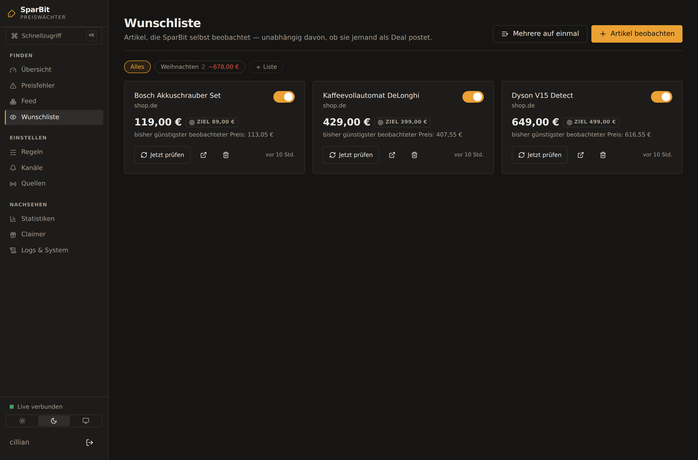

# Was SparBit kann

Der vollstaendige Funktionsumfang, mit den Gruenden dahinter.

## Was SparBit sonst kann

### Finden

**17 Quellen als Plugins**, jede einzeln schaltbar mit eigenem Intervall:

| Gruppe | Quellen |
|---|---|
| Deal-Communities | mydealz, Preisjäger.at, HotUKDeals, Dealabs |
| Blogs | Sparhamster.at, Schnäppchenfuchs |
| Reddit | GameDeals, FreeGameFindings, freebies, googleplaydeals, AppHookup, Schnaeppchen — im UI pflegbar |
| Gaming | Epic Games Store, GOG, Steam, CheapShark, IsThereAnyDeal, GG.deals |
| International | Slickdeals (US), OzBargain (AU) |
| Eigene | beliebige RSS/Atom-Feeds (z. B. deine Geizhals-Wunschliste) |

Die beiden internationalen Quellen rechnen in **USD** bzw. **AUD**. Die
Währung wird dabei nicht geraten: steht im Titel ein Währungszeichen, gewinnt
das, sonst gilt die Vorgabe der Quelle. Ohne diese Festlegung liefe ein
„$ 199" als EUR durch jede Preisregel — und „max. 200 €" würde bei
umgerechnet 180 € mal greifen und mal nicht. OzBargain ist wegen der Zeitzone
oft die erste Quelle, die einen weltweiten Preisfehler meldet.

Fällt eine Quelle aus, laufen die anderen weiter. Nach fünf Fehlern in Folge
pausiert ein Schutzschalter sie automatisch; im UI steht, warum.

**Wunschliste** — Artikel, die SparBit *selbst* beobachtet, unabhängig davon,
ob sie jemand als Deal postet. Du trägst Shop-URL und Zielpreis ein, SparBit
fragt regelmäßig nach und meldet den Preissturz.

Der Preis kommt aus **strukturierten Daten** (JSON-LD, Open Graph, Microdata) —
denselben, die Shops für Suchmaschinen ausliefern, und dem stabilen Teil einer
Produktseite: CSS-Klassen ändern sich bei jedem Redesign, `"@type": "Product"`
nicht. Liefert eine Seite davon nichts, sagt SparBit das klar, statt einen
brüchigen Selektor zu raten.

**Versandkosten zählen mit**, wo der Shop sie auszeichnet: 195 € plus 9,90 €
sind teurer als 199 € versandkostenfrei. Wichtig ist dabei der Unterschied
zwischen *keine Angabe* und *kostenlos* — ohne ihn rechnete man für jeden Shop
ohne Angabe mit 0 € Versand, und das ist eine erfundene Zahl. Steht nichts da,
ist der Gesamtpreis der Artikelpreis, mit derselben Unsicherheit wie vorher.
Gibt der Shop mehrere Lieferoptionen an, zählt die günstigste — wer Express
will, rechnet ohnehin selbst.

**Shops, die ihren Preis erst per JavaScript einsetzen**, bleiben ehrlich
„kann ich nicht lesen". Wer sie trotzdem braucht, trägt unter *Logs & System →
Optionale Helfer* die Adresse eines Render-Dienstes ein (browserless, ein
eigener Playwright-Container) und schaltet ihn je Artikel frei. Bewusst nicht
mitgeliefert: ein Browser im Image wäre ein halbes Gigabyte und ein eigener
Angriffspfad — für eine Handvoll Shops, die das Auslesen ohnehin nicht wollen.

**[Browser-Erweiterung](../browser-extension/)** für Chrome, Edge, Brave und
Firefox — setzt Artikel in einem Klick von jeder Shop-Seite auf die
Wunschliste und zeigt direkt dort, wenn SparBit ihn woanders günstiger kennt.

### Beurteilen

Der von der Quelle gemeldete Rabatt sagt wenig: Händler rechnen gegen eine UVP,
die nie jemand bezahlt hat. SparBit urteilt aus dem **eigenen Preisverlauf**:

| Urteil | Bedeutung |
|---|---|
| **Bestpreis** | so günstig war es noch nie beobachtet |
| **sehr gut / gut** | im unteren Viertel des bisher Gesehenen |
| **normal** | üblicher Preis |
| **war günstiger** | nennt dir, wann es billiger war |
| **UVP fragwürdig** | kam nie in die Nähe seiner angeblichen UVP |

Bei zu wenig Verlauf sagt SparBit **„zu wenig Daten"** statt zu raten. Regeln
können darauf filtern — „nur echte Bestpreise" ist ein Klick.

**Preisvergleich über Quellen.** Derselbe Deal aus vier Communities kommt
einmal an, aber was jede Quelle verlangt, wird einzeln gespeichert. Die
Detailansicht zeigt daraus eine Tabelle, günstigster zuerst, jede Zeile mit
eigenem Link. Fremdwährungen stehen mit ihrem Euro-Gegenwert daneben — sonst
ließe sich `265,00 $` nicht gegen `249,00 €` vergleichen (dort gewinnt der
Dollarpreis).

**Preisverlauf und Preisalarme.** Jede Preisänderung wird aufgezeichnet; in der
Detailansicht siehst du die Kurve mit Tiefst- und Höchstpreis. Ein Preisalarm
löst genau einmal aus, nicht bei jedem Durchlauf.

Produktvarianten bleiben getrennt: „Hades" und „Hades II", „iPhone 15" und
„iPhone 16", „990 Pro" und „990 Evo" sind nicht dasselbe.

### Filtern

Regeln aus Keywords (ODER), Pflicht-Keywords (UND) und Blacklist, dazu
Preisgrenze, Mindestrabatt, „nur 0 €", Mindest-Temperatur, Preisurteil,
**Preisfehler-Punktzahl** sowie Quellen-, Warengruppen- und Händlerfilter.
Priorität **SOFORT** (Push in Sekunden) oder **NORMAL** (Sammelmeldung).

Die **Live-Vorschau** beim Bauen zeigt Trefferzahl, Beispiele, „knapp verfehlt"
und je Deal eine Begründung, warum er getroffen oder gescheitert ist.

#### Warengruppen: *was* es ist, nicht woher es kommt

Zwölf Gruppen — Elektronik, Computer & Zubehör, Gaming, Haushalt & Küche,
Werkzeug & Garten, Kleidung & Schuhe, Drogerie & Gesundheit, Lebensmittel &
Getränke, Spielzeug, Bücher/Filme/Musik, Software & Abos, Reise & Mobilität.

Erkannt wird aus **Stichwörtern im Titel**, nicht aus einem Modell — und zwar
aus einem Grund: die Einteilung muss erklärbar sein. Landet ein Deal unter
„Drogerie", steht daneben, welches Wort das ausgelöst hat. Ein Modell, das
„Elektronik" sagt und nicht warum, wäre in einer Anwendung, die sonst jede
Zahl begründet, ein Fremdkörper.

Deutsch macht das kniffliger als es klingt. „Kaffeevollautomat" setzt das
Hauptwort hinten an, also trifft `vollautomat` auch am Wortende — aber nur ab
acht Zeichen, sonst fände `roller` jeden „Controller". Und `reis ` mit
Leerzeichen heißt: nur das ganze Wort, sonst wäre eine Reise nach Mallorca ein
Lebensmittel.

Was sich nicht erkennen lässt, bleibt **ohne Gruppe**. „Sonstiges" wäre eine
Antwort, die so aussieht, als hätte jemand hingesehen. In den Statistiken
steht diese Menge ausdrücklich mit drin.

Für den Rest gibt es einen optionalen Weg: ein **lokales Ollama** unter
*Logs & System → Optionale Helfer*. Es sieht nur, was die Stichwörter nicht
erkannt haben, darf nur aus den zwölf Gruppen wählen, und was von ihm kommt,
wird als Schätzung gekennzeichnet. Aus, bis du es einschaltest.

#### „Warum kam das nicht an?"

Die Live-Vorschau beantwortet die Frage in die eine Richtung: zu einer Regel
zeigt sie die Deals. Die Gegenrichtung fehlte — und das ist die, die man
abends stellt, wenn ein Fund im Feed steht, aber nicht auf dem Handy war.

In der Detailansicht jedes Deals steht dafür ein Knopf. Dahinter läuft
derselbe Weg ab, den die Zustellung nimmt:

| Stufe | Was sie prüft |
|---|---|
| 18+-Sperre | Ist der Fund als 18+ eingestuft, und ist die Zustellung dafür an? |
| Regeln | **Jede einzelne**, mit dem Grund, woran es lag — meistens ein Stichwort, das anders geschrieben ist |
| Preisfehler-Weg | Der zweite Weg: ohne Regel, ohne Ruhezeit. Reichen die Punkte? Wurde schon gemeldet? |
| Pause | Ist die Zustellung global angehalten (UI oder `/pause`)? |
| Ruhezeit | Und lässt eine SOFORT-Regel sie durch? |
| Kanäle | Hat die treffende Regel überhaupt einen — und ist er an? |
| Versand | Was wirklich passiert ist, mit dem Fehler im Klartext |

Zwei Dinge daran sind wichtig. Erstens läuft die Diagnose **mit demselben
Code**, der auch wirklich entscheidet — eine Diagnose, die anders rechnet als
die Zustellung, schickt einen zum falschen Knopf. Zweitens unterscheidet sie
die beiden Wege: bei einem gewöhnlichen Deal steht der Preisfehler-Weg zwar
auf „gestoppt" (0 von 70 Punkten), aber grau statt rot. Richtig wäre beides,
nur führt das eine am Thema vorbei.

Auch ohne Oberfläche: `python cli.py diagnose <nr>`.

**Der Feed lernt mit.** Was du dir merkst, öffnest oder mit einem Alarm
versiehst, wertet SparBit aus — **lokal, ohne externen Dienst**. Der Feed lässt
sich nach *Für dich* sortieren, und jede Empfehlung sagt, warum sie dasteht
(„passt zu dir: „lego", Händler amazon"). Aus demselben Verhalten schlägt
SparBit fertige Regeln vor: *„16 von 16 gemerkten Deals passen zu ‚lego'"*.
Solange zu wenig Signal da ist, hält es den Mund.

**Suche** über SQLite-FTS5 — schnell auch bei 50.000 Deals, und mit Dingen, die
eine einfache Suche nicht kann. Auf PostgreSQL übersetzt derselbe Parser in
`tsquery`, die Syntax bleibt also dieselbe:

| Eingabe | Bedeutung |
|---|---|
| `lego technic` | beide Wörter |
| `"nintendo switch"` | genau diese Wortfolge — trifft *nicht* „Nintendo 3DS und Switch Lite" |
| `ssd -gebraucht` | „gebraucht" ausschließen |
| `kopfhör*` | Präfix, findet auch „Kopfhörern" |

### Preise richtig lesen

Alles oben steht und fällt damit, dass der Preis stimmt. Das Schwierige daran
ist nicht, Zahlen zu finden, sondern zu entscheiden, **welche** davon der
aktuelle Preis ist: ein Deal-Titel nennt fast immer zwei Beträge, und wer den
falschen nimmt, zeigt den durchgestrichenen UVP als Preis an.

SparBit hängt dafür an jede gefundene Zahl ein Etikett aus dem Wort, das
unmittelbar davor steht (`statt`, `UVP` → alt; `nur`, `jetzt`, `für` → neu) —
aber nur, wenn zwischen Wort und Zahl keine *andere* Zahl liegt. Genau diese
Bedingung entscheidet die kniffligen Fälle:

| Titel | Preis | statt |
|---|--:|--:|
| `12,99€ statt 89,90€` | 12,99 € | 89,90 € |
| `statt 59,99 nur 9,99` | 9,99 € | 59,99 € |
| `Sony XM5 statt 379 € jetzt 229 €` | 229 € | 379 € |
| `Nur 9,99 statt 19,99 €` | 9,99 € | 19,99 € |
| `iPhone 15 für 699 statt 949 Euro` | 699 € | 949 € |
| `3 für 2 Aktion: 14,99 €` | 14,99 € | — |
| `16 GB RAM Notebook ab 499 €` | 499 € | — |

Die letzten beiden Zeilen sind die Bremse: eine Zahl ohne Währungszeichen wird
nur dann als Preis akzeptiert, wenn sie ein **Paar** vervollständigt — es gibt
schon einen „alten" Preis und der neue liegt darunter. Ohne diese Regel meldet
`3 für 2` einen Preis von 2 €.

Steht im Text ein **Gutschein-Code**, holt SparBit ihn heraus und stellt ihn
auf die Karte und in die Meldung — vorher stand er im Fließtext, und der wird
gekürzt: ausgerechnet das Stück, das man an der Kasse braucht. Die eigentliche
Aufgabe dabei ist das Nicht-Finden: ein Deal-Text ist voller Zeichenfolgen,
die aussehen wie ein Code (`WH-1000XM5`, `XXL`, `PS5`). Gesucht wird deshalb
nie nach dem Code allein, sondern immer nach dem Wort, das ihn ankündigt —
und ein Kandidat gilt nur, wenn er Großbuchstaben oder eine Ziffer enthält.
Sonst würde aus „mit dem Code sommer" ein Gutschein „SOMMER", den es nie gab.

Alle Beträge werden zusätzlich in **Euro umgerechnet**, damit „max. 20 €" auch
bei USD-, GBP- und AUD-Quellen greift; in der Oberfläche steht der Gegenwert
daneben (`29,99 $ · ≈ 27,59 €`). Die Kurse kommen **einmal am Tag von der
EZB** — eine Datei, rund 3 KB, kein Schlüssel, kein Konto.

Das ist der einzige ausgehende Abruf, den SparBit von sich aus macht, und
dafür gibt es einen Grund: ein fester Kurs im Code altert still. Niemand
bekommt eine Fehlermeldung, wenn „max. 20 €" seit einem Jahr bei 21,40 €
zuschlägt — die Regel greift einfach ein bisschen daneben, und das fällt erst
auf, wenn man es nachrechnet. Abschalten lässt sich der Abruf unter
*Benachrichtigungen → Währung & Pause*; dann gilt, was du dort einträgst. Wie
alt der Stand ist, steht in beiden Fällen daneben — ein Kurs ohne Datum sieht
aus wie einer von heute. Ab 90 Tagen wird der Kasten gelb, und `/api/health`
meldet einen Mangel. Preis, Streichpreis, Währung und Rabatt ziehen dabei
immer gemeinsam um: übernimmt eine günstigere Quelle in anderer Währung den
Deal, verschwindet der alte Streichpreis, statt mit dem neuen Währungszeichen
stehen zu bleiben. Und ein Prozentwert wird aus den beiden angezeigten Zahlen
gerechnet, nicht von der Quelle übernommen — sonst steht er neben zwei Preisen,
aus denen er sich nicht ergibt.

### Stimmt „gratis" auch?

Der häufigste Ärger mit einem Deal-Melder ist nicht die verpasste
Gelegenheit, sondern die falsche: es steht *kostenlos* da, man klickt, und
die Seite will 14,99 €. Dagegen stehen zwei Vorkehrungen.

**Erstens: worauf sich das Wort bezieht.** Nicht jedes „gratis" im Text meint
die Ware. Früher genügte das bloße Vorkommen — und weil jede zweite
Beschreibung irgendwo *kostenloser Versand* stehen hat, landete reihenweise
Bezahlware im Gratis-Filter. SparBit schaut jetzt, was unmittelbar davor und
danach steht:

| Titel | gratis? | warum |
|---|---|---|
| `Sony XM5 für 229 € inkl. gratis Versand` | nein | gilt nur für den Versand |
| `3 Monate Spotify gratis, danach 10,99 €` | nein | gilt nur für einen Testzeitraum |
| `Nike Schuhe 49,99 € + gratis Socken dazu` | nein | ist eine Zugabe, nicht der Artikel |
| `Buch 12,99 € — kostenlose Rücksendung` | nein | gilt nur für die Rücksendung |
| `Spiel geschenkt, dazu kostenloser Versand` | **ja** | ein unbedingtes „geschenkt" schlägt ein bedingtes |
| `Gratis-Skin im Wert von 9,99 €` | **ja** | „Wert" ist ein alter Preis, kein Kaufpreis |

Auf der Karte steht der Grund dann als kleine Zeile unter dem Preis — sonst
sieht es aus, als hätte SparBit das Wort übersehen.

Zusätzlich gilt quellenübergreifend: meldet eine Quelle `gratis` und nennt im
selben Atemzug einen Preis über null, gewinnt die Zahl. Beides kann nicht
stimmen, und ein Flag kann aus einer Kategorie („Freebies") stammen, ein
Preis nicht.

**Zweitens: nachsehen.** Für jeden als geschenkt oder fast geschenkt
gemeldeten Fund ruft SparBit **die Zielseite auf** und vergleicht mit dem,
was der Händler dort maschinenlesbar auszeichnet — schema.org/JSON-LD,
Microdata, OpenGraph. Also mit dem, was er selbst hinschreibt, nicht mit
irgendeiner Zahl im Fließtext.

| Befund | Abzeichen | Folge |
|---|---|---|
| Seite nennt 0,00 | `geprüft` | nichts, nur bestätigt |
| Seite nennt einen Preis über null | `stimmt nicht` | Preis wird korrigiert, **keine Meldung** |
| Seite führt den Artikel als vergriffen | `abgelaufen` | bleibt sichtbar, **keine Meldung** |
| Nichts Ausgezeichnetes gefunden | — | **nichts** — die Quelle behält recht |

Die letzte Zeile ist die wichtigste. Ein Wächter, der bei Unsicherheit
widerspricht, wäre schlimmer als gar keiner — Cloudflare-Abweisungen,
JavaScript-Shops und Community-Posts liefern keine Preisangabe, und daraus
darf niemand etwas ableiten. Marker im `<script>`-Block zählen ebenfalls
nicht: JS-Vorlagen enthalten reihenweise Bausteine wie „ausverkauft", die auf
der Seite gar nicht vorkommen.

Die Prüfung läuft **vor** den Regeln. Ein Fund, der sich als nicht gratis
herausstellt, trifft eine „nur gratis"-Regel also erst gar nicht — genau das
war der Ärger. Sie ist pro Quellenlauf gedeckelt (Vorgabe 12 Seitenaufrufe),
damit daraus kein Crawler wird, und lässt sich unter *Logs & System →
Gratis-Gegenprobe* abschalten oder enger stellen. In der Detailansicht eines
Deals ruft **Nachsehen** sie von Hand auf.

> Auch hier gilt der Verifizierungsstand des Projekts: die Auswertung ist
> gegen Format-Fixtures geprüft (JSON-LD, Microdata, OpenGraph,
> Cloudflare-Abweisung), nicht gegen echte Shop-Seiten — die Build-Umgebung
> erreicht keinen einzigen Host. Wie sich die Seiten *deiner* Quellen
> verhalten, zeigt erst der Betrieb; die Zahlen dazu stehen in derselben
> Karte.

### 18+-Bereich

Ein getrennter Bereich für Angebote ab 18 — **standardmäßig aus**.
Freischalten unter *Logs & System → 18+-Bereich*, mit Altersbestätigung.

Solange er aus ist, gibt es ihn wirklich nicht: die drei zugehörigen Quellen
werden nicht gelistet, nicht eingeschaltet und nicht gestartet — weder über
die Oberfläche noch über die API noch über die CLI. Der Menüpunkt fehlt, und
`/api/deals?bereich=erwachsen` antwortet 403.

Ist er an, gilt eine einzige Regel: **diese Funde erscheinen nirgendwo
sonst.** Nicht im Feed, nicht in der Übersicht, nicht in der Suche, nicht in
den Statistiken, nicht im CSV-Export, nicht in der Empfehlung „für dich" und
nicht beim Preisfehler-Wächter. Nur auf ihrer eigenen Seite.

**Melden ist noch einmal getrennt.** Zwei Schalter, beide aus:

1. **Je Regel** — ohne das Häkchen *18+-Funde einbeziehen* sieht eine Regel
   diese Deals gar nicht. Sonst würde „alles unter 5 €" den ganzen Bereich
   aufs Handy schicken.
2. **Global** — *Auch über Telegram, Discord & Co. melden*. Aus heißt: nur
   auf der Seite, auch für eine Regel mit Häkchen.

**Eingestuft wird jeder Fund, egal woher er kommt.** Ein Erotik-Deal aus dem
normalen mydealz-Feed landet automatisch hier und nicht im Feed. Die
Einstufung ist zweistufig: ein eindeutiges Wort genügt („Vibrator",
„Satisfyer", „FSK 18"), ein mehrdeutiges nicht („adult", „sexy", „Dessous") —
davon braucht es zwei. Sonst wandert die halbe Modeabteilung hierher und ist
nicht wiederzufinden. Einmal gesetzt bleibt die Marke: derselbe Artikel
rutscht auch dann nicht zurück, wenn er später über eine harmlose Quelle
noch einmal hereinkommt.

Auf der Seite selbst lassen sich die Bilder verdecken (Vorgabe an) — der
Schleier geht beim Darüberfahren weg, Titel und Preis bleiben immer lesbar.

**Sechs Quellen** stehen bereit: die Erotik-Gruppen von `mydealz`,
`Preisjäger.at`, `Dealabs` (FR) und `HotUKDeals` (UK), dazu
`reddit_erwachsen` (Subreddits) und `erotik_feed`, wo du die Adresse eines
beliebigen Shops einträgst. Keine davon ist geprüft, und die vorbelegten
Gruppen-Pfade und Subreddit-Namen sind geraten — was SparBit damit macht,
steht gleich unten unter [Den Feed finden](#den-feed-finden-statt-ihn-zu-raten).
Welche Anbieter als Kandidaten taugen, steht vollständig in
**[ENDPOINTS.md](../ENDPOINTS.md#18-bereich)**.

Aus dem Betrieb kamen dazu drei Meldungen, und sie sind der Grund für den
Umbau, der in den beiden nächsten Abschnitten steht:

```
r/SexToyDeals: HTTPStatusError: Client error '404 Not Found'
r/NSFWdeals: RateLimited: HTTP 429, retry after 58s
https://www.mydealz.de/gruppe/erotik-rss: KeinFeed: HTML-Seite statt Feed
```

Das sind drei verschiedene Probleme, die vorher gleich aussahen — *„Quelle
liefert nichts"* — und bei jedem Lauf gleich wiederkamen. Jetzt gilt:

* **404 bei Reddit** heißt, den Subreddit gibt es nicht. Der Name wird aus
  der Liste gestrichen und landet im Feld *Automatisch entfernt*; vorbelegt
  ist `r/SexToyDeals` deshalb nicht mehr.
* **429** heißt, Reddit drosselt diesen Server — häufig, wenn der VPS in
  einem Rechenzentrums-Netz steht. Das ist kein Defekt: die Quelle bricht
  den Durchlauf ab, macht beim nächsten Lauf **dort weiter, wo sie stand**,
  und der Schutzschalter bleibt offen. Im UI steht dann *gedrosselt bis …*
  statt *Fehler*.
* **HTML statt Feed** heißt, der Pfad war geraten — dafür siehe den
  nächsten Abschnitt.

### Den Feed finden, statt ihn zu raten

Nachgetragen, nachdem ein geratener Pfad im Betrieb danebenlag:

```
https://www.mydealz.de/gruppe/erotik-rss:
ValueError: Kein gueltiger Feed (SAXParseException).
Anfang der Antwort: '<!DOCTYPE html><html class="no-js …
```

Interessant daran: die Antwort war eine **echte Seite** — kein 404 und keine
Cloudflare-Wand. Der Server war erreichbar und wusste, wo sein Feed liegt.
Nur SparBit wusste es nicht. Praktisch jede Seite schreibt das in ihren Kopf:

```html
<link rel="alternate" type="application/rss+xml" href="/rss/gruppe/erotik">
```

Also rät SparBit nicht mehr, sondern fragt. Kommt HTML statt eines Feeds,
liest es die ausgezeichneten Adressen aus der Seite, probiert sie der Reihe
nach (höchstens drei) und **schreibt die funktionierende in die
Quellen-Einstellungen zurück**. Beim nächsten Lauf steht dort die richtige
Adresse, sichtbar im UI. Damit darf in einem Feed-Feld auch die blanke
**Adresse eines Shops** stehen — die Angebotsseite genügt.

#### Wenn die Seite ihren Feed gar nicht auszeichnet

Der nächste Betriebsbericht zeigte den Fall, für den das noch nicht reichte —
mydealz nennt auf seinen Gruppen-Seiten keinen Feed:

```
https://www.mydealz.de/gruppe/erotik-rss: KeinFeed: Der Server hat eine
HTML-Seite geliefert, keinen Feed (Seitentitel: 'Erotik Angebote ⇒ …').
Auf der Seite ist auch kein Feed ausgezeichnet.
```

Unbekannt ist die Adresse deshalb nicht: jede Shop- und Community-Software
legt ihre Feeds an derselben Handvoll Stellen ab. Hilft die Seite nicht
weiter, klappert SparBit deshalb **die Muster der jeweiligen Software** ab:

| Software | Eingetragen | Probiert wird dann |
|---|---|---|
| Pepper (mydealz, Preisjäger, Dealabs, HotUKDeals) | `/gruppe/erotik` | `/rss/gruppe/erotik`, `/gruppe/erotik-rss`, `/gruppe/erotik?rss=1` |
| Pepper-Suche | `/search?q=satisfyer&rss=1` | `/rss/search?q=satisfyer`, `/search/rss?q=satisfyer` |
| Shopify | `/collections/sale` | `/collections/sale.atom` |
| WordPress / WooCommerce | `https://shop.de/angebote/` | `…/feed`, `…/rss`, `…/feed.xml` |

Geraten wird dabei trotzdem nichts: **übernommen wird nur eine Adresse, die
tatsächlich einen Feed zurückgegeben hat** — und sie wird wieder in die
Einstellungen geschrieben. Bei Suchbegriffen wandert nicht nur die eine
Adresse zurück, sondern gleich die **Vorlage für alle Begriffe**; sonst
müsste sich jeder Begriff einzeln heilen.

Das bleibt höflich: höchstens vier Muster pro Adresse, und eine Adresse, bei
der alle durchgefallen sind, wird eine Stunde lang nicht noch einmal
durchprobiert (*Jetzt testen* hebt die Sperrfrist sofort auf). Auch ein 404
löst die Suche aus — bei einem geratenen Pfad heißt er „hier nicht", nicht
„nirgends". Nur dort, wo die Adresse nachweislich stimmt, ist das abgeschaltet:
bei Reddit-Subreddits ist ein 404 endgültig (siehe unten).

Willst du es vorher wissen: **Quellen → Feed suchen**, oder auf der
Kommandozeile:

```
$ python cli.py feed-suche https://pypi.org/
  2 Feed-Adresse(n) gefunden auf 'PyPI · Der Python Package Index'.

  Feed-Adresse                       Titel                        Herkunft
  https://pypi.org/rss/updates.xml   RSS: Letzte 40 Aktualisier…  ausgezeichnet
  https://pypi.org/rss/packages.xml  RSS: 40 neueste Pakete       ausgezeichnet
```

„Ausgezeichnet" heißt: die Seite gibt diesen Feed selbst an. „Geraten" heißt:
die Adresse stand in einem Link und *sieht aus* wie ein Feed. Ein
`rel="alternate icon"` — das Favicon, das in jeder zweiten Seite steht —
zählt ausdrücklich nicht.

Und die Fehlermeldungen sagen jetzt, was zu tun ist. Statt
`SAXParseException` steht dort entweder *„Der Server hat eine HTML-Seite
geliefert (Seitentitel: …). Auf der Seite ist auch kein Feed ausgezeichnet"*
— oder *„Bot-Abwehr statt Inhalt — ein anderer Pfad hilft dagegen nicht."*
Das sind zwei verschiedene Probleme, und man sucht sonst am falschen Ende.

### Melden

**Zwölf Kanäle als Plugins**, beliebig viele parallel, jeder einzeln
abschaltbar und mit *Test senden* sofort prüfbar:

| Kanal | Wofür | Was du brauchst |
|---|---|---|
| **Telegram** | unterwegs, mit Aktions-Knöpfen | Bot-Token + Chat-ID |
| **Discord** | eigener Server, Einbettung mit Farbe und Bild | Webhook-URL |
| **Slack** | Team-Kanal, Block-Kit-Nachricht | Webhook-URL |
| **Matrix** | eigener Homeserver, keine fremde Cloud | Zugangstoken + Raum-ID |
| **Gotify** | selbst gehosteter Push | Server + App-Token |
| **Pushover** | Push auf iOS/Android ohne eigenen Server | App-Token + Benutzerschlüssel |
| **ntfy** | Push ohne Konto, ntfy.sh oder eigene Instanz | Topic |
| **E-Mail** | Archiv, Weiterleitung, Filterregeln im Mailclient | SMTP-Zugang |
| **Webhook** | n8n, eigene Skripte | URL (bekommt JSON) |
| **Home Assistant** | Sensor drüben, ohne Basteln | MQTT-Broker |
| **Desktop** | derselbe Rechner, kein Konto nötig | ein Klick im Browser |
| **Apprise** | über hundert weitere Dienste | eine Adresszeile |

Für **Home Assistant** gab es schon den Webhook-Kanal. Der funktioniert, aber
man muss drüben von Hand eine Automation bauen, das JSON auseinandernehmen und
daraus einen Sensor basteln — eine halbe Stunde Arbeit für etwas, das MQTT von
sich aus kann. Der eigene Kanal legt beim ersten Senden eine Beschreibung
seiner selbst ab (MQTT-Discovery); danach steht drüben ein Gerät „SparBit" mit
dem Sensor *Letzter Deal*, und Preis, Urteil, Gutschein-Code, Bild und Link
hängen als Attribute daran. Alles `retain`: nach einem Neustart von Home
Assistant steht sofort wieder der letzte Fund da statt „unbekannt".

Jede Meldung trägt **das Preisurteil mit** — ein Bestpreis kommt grün, ein
Preisfehler rot mit seiner Begründung, eine SOFORT-Regel gelb. Discord erwähnt eine Rolle nur
bei SOFORT, Gotify und ntfy heben dann die Priorität an; sonst bleibt es leise.

**Ein Deal, eine Nachricht** — auch wenn drei Regeln ihn treffen. Die Meldung
nennt alle, die Priorität ist die höchste davon.

**Der stündliche Digest ist einer**: was wegen Ruhezeit oder Priorität liegen
blieb, kommt als *eine* Sammelmeldung mit den besten Funden zuerst — nicht als
zwanzig Einzelnachrichten.

**SparBit meldet auch sich selbst.** Fällt eine Quelle aus oder stellt ein
Kanal nicht mehr zu, erfährst du es — höchstens einmal je Problem und Tag,
mit Entwarnung. Ein Wächter, der still ausfällt, ist schlimmer als keiner.

* Ruhezeiten, die SOFORT-Regeln durchlassen
* Global pausieren — im UI oder per `/pause` in Telegram

### Drumherum

**Durchsicht** — auf der Regel-Seite steht, welche Regel viel Lärm und wenig
Beachtung erzeugt, welche leerläuft (oft ein Tippfehler im Stichwort) und
welche Quelle nur Füllmaterial liefert. Mit Vorschlag je Befund, aber ohne
Automatik: du entscheidest.

**Statistiken** — Verlauf, Ausbeute je Quelle inklusive *Signalanteil* (wie viel
Prozent der Funde eine Regel getroffen haben) und häufigste Händler. Damit
siehst du, welche Quelle nur Rauschen liefert.

**Wunschliste in einem Rutsch** — mehrere Shop-Adressen einfügen, eine je
Zeile; Namen und Preise holt SparBit selbst.

**Bilder bleiben bei dir** — Deal-Bilder werden einmal geholt, verkleinert unter
`./data/images` abgelegt und von SparBit ausgeliefert. Ohne das erführe jeder
Händler bei jedem Öffnen des Feeds, welche Deals du dir ansiehst.

**Bedienung** — hell/dunkel/wie im System, **Strg/Cmd + K** für den
Schnellzugriff, `/` springt in die Suche, `g` gefolgt von
`d`/`f`/`s`/`w`/`q`/`r` navigiert. Gespeicherte Suchen, CSV-Export,
JSON-Backup und -Import. Als App installierbar (PWA), voll bedienbar auf dem
Handy.

**Auto-Claimer** — Epic, Prime Gaming und GOG holen ihre Gratis-Titel selbst,
über [vogler/free-games-claimer](https://github.com/vogler/free-games-claimer)
in einem eigenen Container. Einrichtung [unter Docker](#auto-claimer-einrichten).




*Wunschlisten mit Budget — die Leiste sagt, ob es noch reicht.*

## Wissen statt raten: die Produktkennung

Ob zwei Angebote derselbe Artikel sind, entschied lange der Titelvergleich.
Der ist erstaunlich gut geworden — aber er bleibt Raten: „Sony WH-1000XM5
Schwarz" und „Sony Kopfhörer WH1000XM5, schwarz" sind für jeden Schwellenwert
ein Grenzfall.

Viele Adressen tragen die Antwort mit sich: die **ASIN** in einer
Amazon-URL, die **AppID** bei Steam, die **GTIN/EAN** in den ausgezeichneten
Daten einer Produktseite. Wo eine Kennung da ist, wird nicht mehr geraten —
und zwei verschiedene Kennungen trennen Titel, die fast gleich heißen
(„iPhone 15 128 GB" / „256 GB").

Das hilft doppelt: der Preisvergleich bekommt Zeilen, wo vorher zwei
getrennte Deals standen — und damit bekommt der Preisfehler-Wächter endlich
**Fremdpreise**, sein stärkstes Indiz nach der Kommastelle.

Die Kennung gilt ohne Zeitfenster: die Kandidatenliste des Fuzzy-Vergleichs
reicht 72 Stunden zurück, eine ASIN findet den Artikel auch nach vier Wochen.

## Wann etwas endet

Ein Rabatt, den man morgen auch noch mitnimmt, ist ein Rabatt. Ein
Gratis-Spiel, das Donnerstag um 17 Uhr verschwindet, ist ein Termin.

SparBit liest das Ende aus den Rohdaten, wo die Quelle es angibt (Epic
schickt es seit jeher mit), und aus dem Text, wo es jemand hingeschrieben
hat: „nur bis 31.10.", „endet am 5. November", „noch 3 Tage". Bewusst
zurückhaltend — lieber kein Datum als ein falsches. Wer wegen „läuft in 2 h
aus" hetzt und es stimmt nicht, glaubt der nächsten Meldung nicht mehr.

Daraus entstehen die Auslauf-Erinnerung und der
[Kalenderfeed](benachrichtigungen.md#fristen-im-kalender).

## Mehrere Wunschlisten

Eine einzige Liste vermischt, was nichts miteinander zu tun hat:
Weihnachtsgeschenke, Ersatzteile, das Projekt im Keller. Listen trennen das —
mit einem Budget je Liste, das die Frage beantwortet, die bei Geschenken
zuerst kommt: reicht es noch?

Die Leiste zeigt den Rest (negativ, wenn überzogen) und wie viele Artikel
ihren Zielpreis erreicht haben. Artikel ohne lesbaren Preis werden gezählt,
aber nicht geschätzt — eine erfundene Summe wäre schlimmer als eine
unvollständige. Eine Liste zu löschen löst die Ordnung auf, nicht die Arbeit:
die Artikel bleiben.

**Steam-Wunschliste übernehmen:** Profilname, Steam-ID oder die Adresse der
Wunschliste eintragen, fertig. Ohne API-Schlüssel. Unter *Profil →
Privatsphäre* muss „Spieledetails" auf *öffentlich* stehen — steht es das
nicht, sagt SparBit genau das, statt ein leeres Ergebnis zu zeigen.

## Deine Bilanz

Unter *Statistiken* steht, was das Ganze gebracht hat: geschätzte Ersparnis,
gemerkte Artikel, mitgenommene Gratis-Sachen, geclaimte Spiele.

Zwei Vorsichtsmaßnahmen halten die Zahl ehrlich. Gerechnet wird gegen den
**beobachteten Referenzpreis** (Median des eigenen Verlaufs), nicht gegen die
UVP — gegen eine UVP zu rechnen, die nie jemand bezahlt hat, wäre genau der
Taschenspielertrick, den SparBit den Händlern vorwirft. Und gezählt wird nur,
was du angefasst hast: was ungesehen vorbeizog, hat dir nichts gespart, egal
wie günstig es war.

Es bleibt eine Schätzung, und sie sagt das auch.

## Mehrere Konten im Haushalt

Die Wunschliste des einen hat mit den Regeln des anderen nichts zu tun. Unter
*Logs & System → Konten* legt ein Administrator weitere an.

| Rolle | Darf |
|---|---|
| **Admin** | alles — Quellen, Konten, Sicherungen, Updates |
| **Mitglied** | eigene Regeln, Kanäle, Wunschlisten, Suchen |
| **Gast** | zusehen |

**Getrennt:** Regeln, Kanäle, Wunschlisten samt Listen, gespeicherte Suchen,
API-Token, Push-Geräte und die gelernten Vorlieben — zwei Geschmäcker in
einem Modell ergeben keinen Durchschnitt, sondern Rauschen.

**Gemeinsam:** Quellen (sie kosten Anfragen bei fremden Servern und gehören
der Anlage), die gesammelten Deals und die Systemeinstellungen.

Ein Konto abzuschalten ist die vorsichtige Variante: die Anmeldung geht nicht
mehr, Regeln und Wunschliste bleiben. Der letzte Administrator kann sich
weder entmachten noch abschalten.

## Regeln weitergeben

Eine gute Regel ist Arbeit. Über *Regeln → Teilen* geht sie als JSON raus —
ohne Kanal-Zuordnung und Trefferzahlen, damit sie woanders funktioniert.

Eingespielte Regeln kommen **ausgeschaltet** an. Eine fremde Regel, die
sofort losmeldet, ist der schnellste Weg zu einem stummgeschalteten Kanal:
erst ansehen, dann einschalten.

Für Feeds gibt es denselben Weg über **OPML** — das Format, in dem jeder
Feedreader seine Abos hält.

---

[← Zurück zur Übersicht](../README.md)
